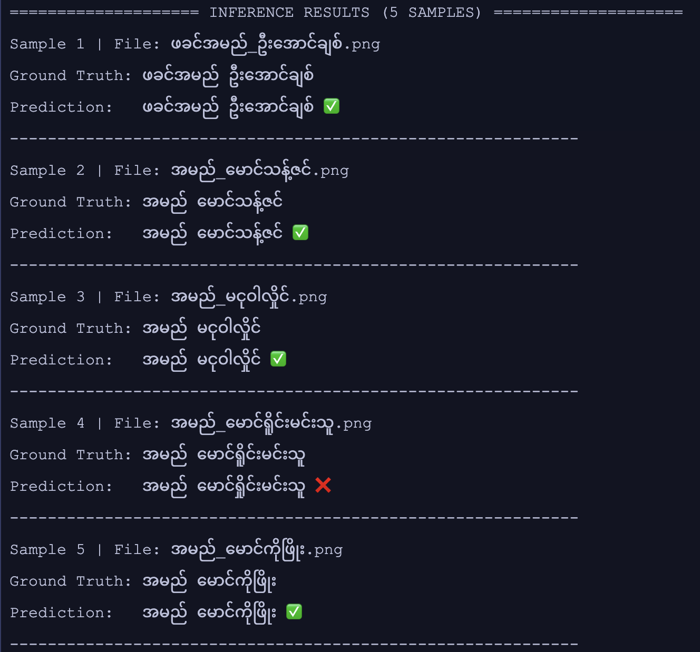
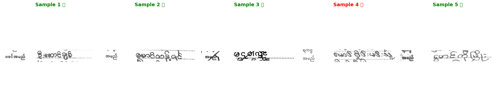

# myNRC-OCR: A Hybrid OCR Framework for Handwritten Myanmar NRCs Integrating YOLOv8, Tesseract LSTM, TrOCR, and Post-OCR Correction

> **Publication Status:** This paper has been formally accepted to the *Joint International Conference on Computer Science and Software Engineering (JCSSE 2026)*. Official IEEE Xplore proceedings are forthcoming. In the interim, the full accepted author manuscript is available publicly on [ResearchGate](https://www.researchgate.net/publication/402542486_myNRC-OCR_A_Hybrid_OCR_Framework_for_Handwritten_Myanmar_NRCs_Integrating_YOLOv8_Tesseract_LSTM_TrOCR_and_Post-OCR_Correction).

myNRC-OCR is a specialized hybrid framework developed for extracting complex handwritten and printed data from Myanmar National Registration Cards (NRCs). Accurate OCR for Myanmar's National Registration Cards (NRCs) is essential for digital KYC but remains challenging due to complex script orthography, handwritten entries, and low-resource data. This project proposes an end-to-end framework integrating object detection, multi-model recognition, and a 3-tier linguistic post-OCR correction module.

This repository contains the official sample resources for the paper **"myNRC-OCR: A Hybrid OCR Framework for Handwritten Myanmar NRCs Integrating YOLOv8, Tesseract LSTM, TrOCR, and Post-OCR Correction"**. 

## Contents

To support partial reproducibility and foster ongoing research in low-resource OCR, we have provided the following core pipeline notebooks:

* **`preprocessing.ipynb`**: Demonstrates the image and text preparation pipeline. This includes the logic for OpenCV-based image cleaning (Otsu thresholding, morphological operations), label normalization using `unicodedata` and `regex` (standardizing to Unicode NFC, stripping zero-width characters), and spatial/photometric data augmentations via Albumentations.
* **`train_public.ipynb`**: Contains the Hugging Face `Seq2SeqTrainer` configuration for fine-tuning the TrOCR model. This notebook includes the exact model architecture (ViT encoder + SEA-LION BERT decoder) and hyperparameters described in Section III.B of our paper (e.g., FP16 mixed-precision, gradient accumulation of 4, 30 epochs, 1e-5 learning rate). 

## Qualitative Research Results

The following examples show a representative end-to-end inference result from the proposed myNRC-OCR pipeline, including preprocessing, region extraction, text recognition, and post-OCR correction.

| Input NRC Sample | OCR Output Visualization |
| --- | --- |
|  |  |

**Figure:** Qualitative comparison of raw input and model output. The system preserves key identity fields and produces structured, human-readable text suitable for downstream KYC verification workflows.

These examples are intended to illustrate model behavior in realistic document conditions (e.g., mixed printed and handwritten fields, variable illumination, and background noise) while respecting privacy constraints through controlled sample publication.

## Citation

If you use this project, dataset samples, or methodology in your research, please cite:

Zaw Linn Htet, Pyae Linn, Htoo Thet Naung, Htet Arkar Kyaw, Charnon Pattiyanon, Tianwei Jing, "myNRC-OCR: A Hybrid OCR Framework for Handwritten Myanmar NRCs Integrating YOLOv8, Tesseract LSTM, TrOCR, and Post-OCR Correction," in *Proceedings of the 23rd International Joint Conference on Computer Science and Software Engineering (JCSSE 2026)*, Bangkok, Thailand, June 2026.

**Abstract (summary):**  
Handwritten OCR for Myanmar script is hindered
by complex orthography, character stacking, and limited
annotated data. We propose myNRC-OCR, a hybrid framework
for robust text extraction from Myanmar National Registration
Cards (NRCs). The pipeline utilizes YOLOv8 for field
localization, followed by a comparative recognition study between
Tesseract LSTM and Transformer-based TrOCR. 

## Dataset & Privacy Notice

Due to commercial licensing constraints with Dinger Research and stringent regional data privacy regulations regarding National Registration Cards, the complete private NRC dataset and the fine-tuned model weights remain proprietary. 

To enable researchers to test the preprocessing and training pipelines, we are providing a **Synthetic Sample Dataset** hosted on Hugging Face: https://huggingface.co/datasets/PyaeLinn/myNRC-OCR_Sample-Dataset

This synthetic dataset mimics the statistical distribution, morphological complexity, and background artifacts of the original data without exposing any real Personally Identifiable Information (PII) or violating user consent.

*Note: In `train_public.ipynb`, proprietary database connectors and internal MLOps tracking hooks have been removed to comply with company security policies. The core machine learning logic remains fully intact.*

## Live Demonstration

A deployed version of the myNRC-OCR system is accessible via our frontend API wrapper at: **https://dingerkyc.streamlit.app/**

*(Note: Due to KYC data privacy regulations, the live demo is access-controlled. Credentials for academic verification or testing purposes may be requested by contacting the corresponding author.)*

## Support
This project is proprietary to Dinger. For access requests or operational issues, contact the platform/ML engineering team through the usual internal channels.

Reach out to the maintainer zaw.linn.htet03@gmail.com to obtain the current admin credentials, then use the Streamlit URL you were provided to log in and run evaluations. 
